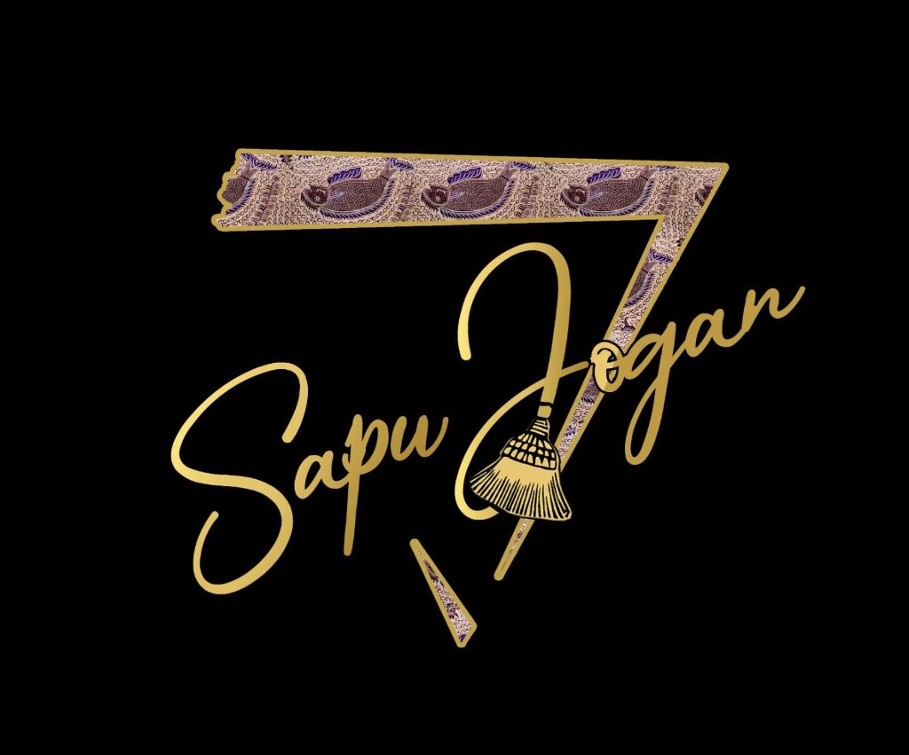

# Sapujogan Landing Page

Landing page untuk Sanggar Seni Sapujogan, dibangun dengan Laravel, Inertia, React, Vite, dan Tailwind CSS. Halaman ini memakai tema high-density dengan latar hitam, aksen emas, dan struktur React yang mudah dikembangkan menjadi modul tambahan seperti agenda, katalog karya, pendaftaran kelas, atau dashboard pengelolaan konten.

<p align="center">
  
</p>

## Fitur

- Landing page responsif untuk profil Sanggar Seni Sapujogan.
- Desain high-density dengan latar hitam, aksen emas, grid dekoratif, dan kartu konten.
- Integrasi Laravel + Inertia + React untuk fondasi aplikasi yang modular.
- Konten utama dipisahkan dalam data dan komponen kecil di React agar mudah dikonfigurasi.
- Asset logo tersedia di `public/images/logo-sapujogan.png`.

## Tech Stack

- PHP `^8.3`
- Laravel `^13.8`
- Inertia Laravel `^3.1`
- React `^19.2`
- Vite `^8.0`
- Tailwind CSS `^4.0`

## Kebutuhan Sistem

Pastikan sudah tersedia:

- PHP 8.3 atau lebih baru
- Composer
- Node.js dan npm
- Database yang sesuai konfigurasi `.env`

## Instalasi

Clone repository, lalu masuk ke folder proyek:

```bash
git clone <repository-url>
cd sapujogan
```

Install dependency backend dan frontend:

```bash
composer install
npm install
```

Siapkan file environment:

```bash
cp .env.example .env
php artisan key:generate
```

Jika memakai database lokal, sesuaikan konfigurasi database di `.env`, lalu jalankan migrasi:

```bash
php artisan migrate
```

## Menjalankan Development

Jalankan server Laravel:

```bash
php artisan serve
```

Di terminal lain, jalankan Vite:

```bash
npm run dev
```

Atau gunakan script bawaan Laravel untuk menjalankan server, queue, log, dan Vite secara bersamaan:

```bash
composer run dev
```

Aplikasi akan tersedia di:

```text
http://127.0.0.1:8000
```

## Build Production

Untuk membuat asset frontend production:

```bash
npm run build
```

## Testing

Jalankan test Laravel:

```bash
php artisan test
```

## Struktur Penting

```text
routes/web.php                  Route utama yang render halaman Inertia Home
resources/views/welcome.blade.php Root shell Inertia
resources/js/app.jsx            Entry point React + Inertia
resources/js/Pages/Home.jsx     Komponen landing page Sapujogan
resources/css/app.css           Tailwind CSS dan base style
public/images/logo-sapujogan.png Logo Sapujogan untuk halaman publik
```

## Konfigurasi Konten

Konten landing page dapat diedit dari `resources/js/Pages/Home.jsx`.

Beberapa bagian yang sudah dibuat sebagai data:

- `navigation` untuk menu anchor.
- `focusAreas` untuk program utama.
- `signals` untuk highlight angka/informasi.
- `agenda` untuk daftar kegiatan.
- `values` untuk nilai atau karakter sanggar.

Struktur ini memudahkan pengembangan berikutnya, misalnya memindahkan data ke API, database, CMS, atau modul admin tanpa mengubah layout dasar secara besar-besaran.

## Catatan Deployment

Untuk deployment production, pastikan menjalankan:

```bash
composer install --optimize-autoloader --no-dev
npm ci
npm run build
php artisan config:cache
php artisan route:cache
php artisan view:cache
```

Pastikan web server mengarah ke folder `public`.

## Lisensi

Proyek ini dibuat untuk kebutuhan landing page Sanggar Seni Sapujogan. Sesuaikan informasi lisensi repository sesuai kebutuhan pemilik proyek.
